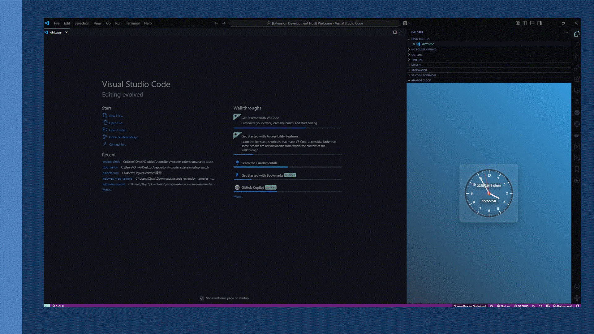

# Pomodoro Timer for VS Code ⏱️

A beautiful, feature-rich Pomodoro timer extension that helps you stay focused and productive using the Pomodoro Technique.

<p align="center">
  
</p>

## Installation 💻

1. Open Visual Studio Code
2. Press `Ctrl+P` (Windows/Linux) or `Cmd+P` (macOS)
3. Type `ext install pomodoro-timer-vscode`
4. Press Enter

## Features ✨

- **Elegant Interface**: Clean, modern design that integrates seamlessly with VS Code's sidebar
- **Customizable Timers**: Configure work sessions, short breaks, and long breaks
- **Visual Progress**: Circular progress indicator with smooth animations
- **Session Tracking**: Keep track of completed sessions and current progress
- **Smart Notifications**: Get notified when sessions complete (can be disabled)
- **Persistent State**: Timer continues running even when you switch files or restart VS Code
- **Responsive Design**: Adapts to different sidebar widths

## How to Use 📝

1. After installation, click the "Explorer" icon in the VS Code sidebar
2. Find the "Pomodoro Timer" panel at the bottom of the Explorer view
3. Click "Start" to begin your first work session
4. Use the controls to pause, reset, or skip sessions as needed

<p align="center">
  
</p>

## The Pomodoro Technique 🍅

The Pomodoro Technique is a time management method developed by Francesco Cirillo that uses a timer to break work into intervals, traditionally 25 minutes in length, separated by short breaks. These intervals are named "pomodoros".

**How it works:**
1. Decide on the task to be done
2. Set the timer for 25 minutes (one pomodoro)
3. Work on the task until the timer rings
4. Take a short 5-minute break
5. After 4 pomodoros, take a longer break (15-30 minutes)

The technique is based on the idea that frequent breaks can improve mental agility and help maintain focus over extended periods.

## Configuration ⚙️

You can customize the timer settings in VS Code settings:

1. Open `File > Preferences > Settings` from the VS Code menu
2. Type "Pomodoro Timer" in the search bar
3. Adjust any of the following settings:

| Setting | Description | Default |
|---------|-------------|---------|
| Work Duration | Length of work sessions (1-60 minutes) | 25 |
| Break Duration | Length of short breaks (1-30 minutes) | 5 |
| Long Break Duration | Length of long breaks (1-60 minutes) | 15 |
| Long Break Interval | Number of work sessions before a long break (2-10) | 4 |
| Show Notifications | Enable/disable completion notifications | true |
| Background Color | Customize the timer's accent color (HEX format) | #e74c3c |

### settings.json

You can also configure the extension directly in your `settings.json` file:

```json
{
  "pomodoroTimer.workDuration": 25,
  "pomodoroTimer.breakDuration": 5,
  "pomodoroTimer.longBreakDuration": 15,
  "pomodoroTimer.longBreakInterval": 4,
  "pomodoroTimer.showNotifications": true,
  "pomodoroTimer.backgroundColor": "#e74c3c"
}
```

## Changelog 📋

See all changes in the [CHANGELOG](./CHANGELOG.md).

## License ⚖️

This project is licensed under the [MIT](./LICENSE) license.

## About the Author 👤

Created by Sidharth Kumar - [GitHub](https://github.com/sidharthkumar) - July 2025

Boost your productivity and maintain focus during coding sessions with the Pomodoro Timer extension!
